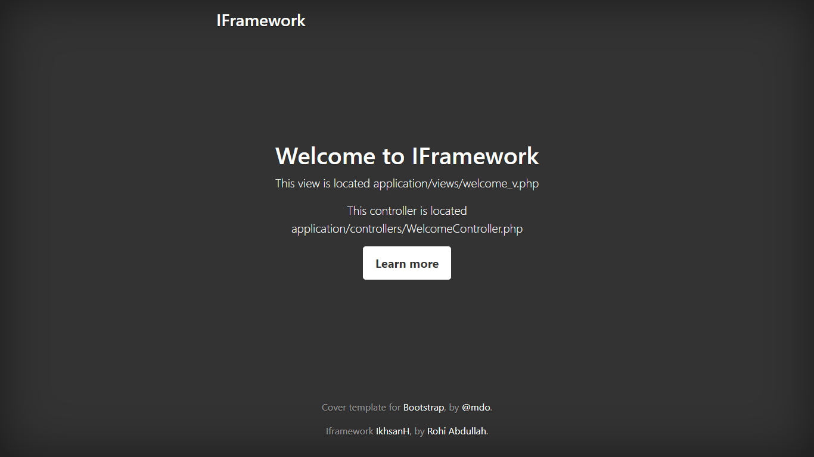

# iframework
sebuah framework MVC sangat sederhana untuk hanya sekedar melakukan operasi crud

### How To Use :

- setting konfigurasi di file config/config.php
- 
- import database iframework.sql sebagai contoh 
- lokasi Controller application/controllers & konvensi penamaan controller -> ExampleController.php
- lokasi Model application/models & konvensi penamaan model -> Example_m.php
- lokasi View application/views & konvensi penamaan view -> example_v.php
- 
- untuk membuat tampilan cara nya $this->template('example/index');
- mirip dengan template engine laravel, file utama tampilan bisa disimpan di views/template/example_v.php

### Tampilan Framework :

